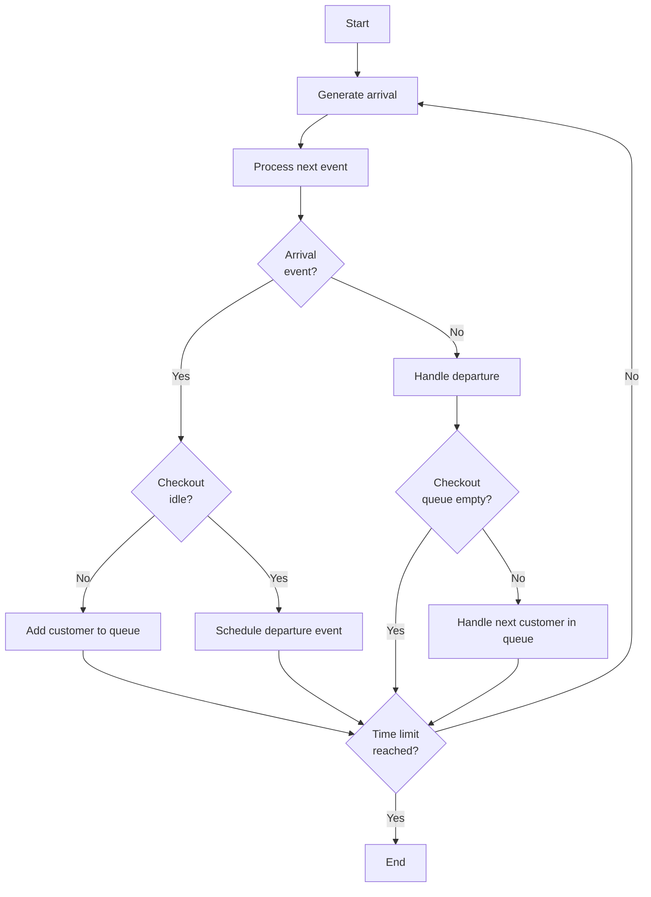

# Grocery Store Checkout Simulation

## Overview
The Grocery Store Checkout Simulation provides an event-based representation of checkouts at a grocery store, encompassing both cashier-operated and self-checkout counters. By leveraging real Point-Of-Sale (POS) data[^1], this simulation offers a genuine portrayal of the grocery store checkout experience. The project identifies the best-fit statistical distribution for various events, guaranteeing increased realism.

A detailed paper explaining the project in German can be accessed at [Paper_German.pdf](Paper_German.pdf).

## Key Features:
1. **Event-driven simulation**: The simulation progresses by processing events, such as customer arrivals and departures.
2. **Data-driven design**: the simulation uses real pos data[^1] to model behaviors and timings.
3. **Multiple checkouts**: the supermarket can have a mix of cashier checkouts and self-checkouts.
3. **Customizable parameters**: the user can specify parameters such as the number of checkouts, arrival rates, processing rates, and others (see [Customizable Parameters](#customizable-parameters)).
4. **Logging**: the simulation logs various details, including individual events, customer details, and the queue lengths at different checkouts.

## Simulation Flow:

## How To Use:

1. **Initialization**: <br> create a simulation object by providing necessary parameters such as number of cashier checkouts, self-checkouts, time constraint, etc. (see [Customizable Parameters](#customizable-parameters) for more details). 
```python
my_sim = simulation(num_cc=16, num_sc=1, t_max=10000)
```
2. **Run the simulation**: <br> call the `simulate` on the simulation object.
```python
event_log, customer_log, queue_log = my_sim.simulate()
```
3. **Export logs**: <br> export the logs to desired format.
```python
event_log.to_csv('event_log.csv')
customer_log.to_csv('customer_log.csv')
queue_log.to_csv('queue_log.csv')
```

Alternatively you can use the `checkout`, `customer`, and `queue` classes to build your own simulation.

## Customizable Parameters:
When initializing the simulation using the Simulation class, you can set various parameters to influence the behavior and outcome of the simulation. Here's a list of these parameters with brief descriptions:

1. `s_seed`: Seed for random number generation.
2. `t_max`: Duration of the simulation in seconds. 
3. `distribution`: Chosen distribution for processing times. Can be "POS" (based on Point-Of-Sale data) or "exp" (exponential).
4. `proc_exp_cc` & `proc_exp_sc`: Parameters for exponential distribution on cashier checkouts and self-checkouts, respectively.
5. `proc_pos_cc_loc`, `proc_pos_cc_scale`, `proc_pos_sc_loc`, `proc_pos_sc_scale`: Location and scale parameters for transaction time based on POS data for cashier and self-checkouts.
6. `arrival_rate`: Scale rate parameter for the exponential distribution of customer arrivals.
7. `num_cc` & `num_sc`: Number of cashier checkouts and self-checkouts, respectively.
8. `c_quant` & `sc_quant`: Quantity of customers that can be handled at once at cashier checkout and self-checkout, respectively.
9. `item_scale`: Scale parameter for generating the number of items a customer buys.

## Experiments
Three experiments are provided in the `main` method of [my_sim.py](my_sim.py):
1. 16 cashier checkouts, 1 self-checkout, 10000 seconds time constraint.
2. 22 cashier checkouts, 1 self-checkout, 10000 seconds time constraint.
3. 16 cashier checkouts, 2 self-checkouts, 10000 seconds time constraint.

The logs for these experiments can be found in the [Logs](Logs) folder.

## Potential Use Cases:

- **Resource allocation**: Understand customer flow and wait times to optimize the number of active checkouts.
- **Enhancing customer experience**: Glean insights from the simulation to develop strategies aimed at reducing wait times and elevating the overall checkout experience.
- **Scenario analysis**: The simulation's versatility supports modeling of diverse scenarios, such as peak shopping hours, special sales events, or times with limited staff.

## Conclusion:
this simulation provides insights into how different numbers and types of checkouts affect the customer experience in a supermarket. by analyzing the logs, one can make informed decisions about optimizing the number and type of checkouts to minimize customer waiting times and improve efficiency.

[^1]: data Source: [Point of Sale (POS) Data from a Supermarket: Transactions and Cashier Operations](https://www.mdpi.com/2306-5729/4/2/67)


