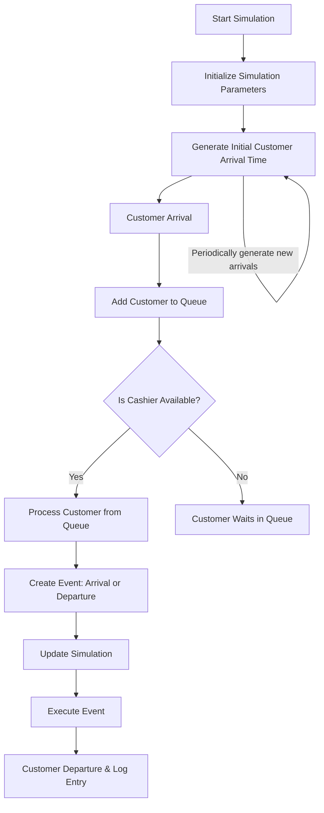

# Grocery Store Checkout Simulation

## Overview
The Grocery Store Checkout Simulation provides an event-based representation of checkouts at a grocery store, encompassing both cashier-operated and self-checkout counters. By leveraging real Point-Of-Sale (POS) data[^1], this simulation offers a genuine portrayal of the grocery store checkout experience. Coupled with the `fitter` library, the project identifies the best-fit statistical distribution for various events, guaranteeing increased realism. 

A detailed paper explaining the project in German can be accessed at [Paper_German.pdf](Paper_German.pdf).

## Key Features:

1. **Dynamic Customer Arrivals**: Simulates customer arrivals using an exponential distribution, providing a realistic flow of customers.
2. **Queue Management**: Manages queues efficiently, ensuring they are processed as soon as a cashier becomes available.
3. **Event-Driven Logic**: Employs events to represent customer arrivals and departures, forming the core of the simulation.
4. **Data-Driven Design**: Integrates real POS data[^1] to model behaviors and timings.
5. **Comprehensive Logging**: Keeps a log of events, offering insights into system performance, customer wait times, and queue lengths.

## Simulation Flow:

## How to Use:

- Install the required Python libraries: `numpy`, `pandas`, `tqdm`, and `fitter`. 
- Run the `my_sim.py` script to start the simulation. You can adjust internal parameters to simulate different scenarios or conditions.
- Additionally, you can import the classes to design your own simulation.

## Potential Use Cases:

- Resource Allocation: Understand customer flow and wait times to optimize the number of active checkouts.
- Enhancing Customer Experience: Glean insights from the simulation to develop strategies aimed at reducing wait times and elevating the overall checkout experience.
- Scenario Analysis: The simulation's versatility supports modeling of diverse scenarios, such as peak shopping hours, special sales events, or times with limited staff.

## Conclusion:
The Grocery Store Checkout Simulation highlights the effectiveness of event-based simulations in portraying and enhancing real-world operations. By merging data-driven insights with statistical modeling, this project provides invaluable intelligence that can profoundly influence retail operations.

[^1]: Data Source: [Point of Sale (POS) Data from a Supermarket: Transactions and Cashier Operations](https://www.mdpi.com/2306-5729/4/2/67)

