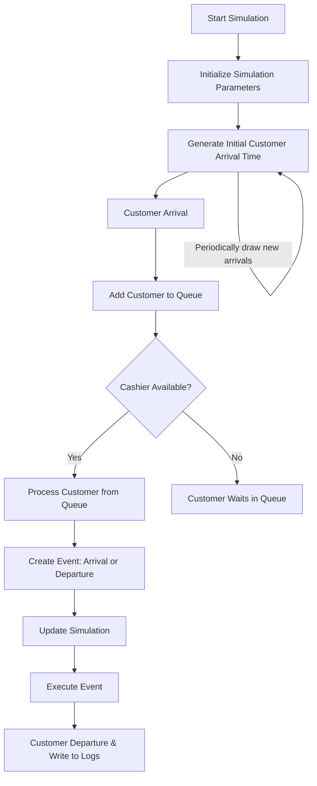

# Grocery Store Checkout Simulation

## Overview
The Grocery Store Checkout Simulation is an event-based representation of checkouts at a grocery store, encompassing both cashier-operated and self-checkout counters. By leveraging real Point-Of-Sale (POS) data[^1], this simulation captures a genuine portrayal of the grocery store checkout experience. With the added benefit of the `fitter` library, the project identifies the best-fit statistical distribution for various events, ensuring heightened realism.

## Key Features:

1. **Dynamic Customer Arrivals**: Simulates customer arrivals based on an exponential distribution, providing a realistic flow of customers.
2. **Queue Management**: Efficiently manages a queue of waiting customers, ensuring they are processed as soon as a cashier becomes available.
3. **Event-Driven Logic**: Uses events to depict customer arrivals and departures, which are the backbone of the simulation.
4. **Data-Driven Design**: Incorporates real POS data to model behaviors and timings.
5. **Comprehensive Logging**: Maintains logs of events, providing insights into the system's performance and customer wait times and queue lengths.

## Simulation Flow:

## How to Use:

- Ensure the required Python libraries are installed: `numpy`, `pandas`, `tqdm`, and `fitter`. 
- Execute the `my_sim.py` script to initiate the simulation. Internal parameters can be tweaked to simulate different scenarios or conditions.
- You can also import the classes and create your own simulation.

## Potential Use Cases:

- **Resource Allocation**: By understanding customer flow and wait times, store management can optimize the number of open checkouts.
- **Customer Experience Enhancement**: Insights from the simulation can guide strategies to reduce wait times and improve the overall checkout experience.
- **Scenario Analysis**: The flexibility of the simulation allows for the modeling of various scenarios, such as peak shopping hours, special sale events, or reduced staff availability.

## Conclusion:
The Grocery Store Checkout Simulation showcases the power of event-based simulations in capturing and improving real-world processes. By blending data-driven insights with statistical modeling, the project offers actionable intelligence that can significantly benefit retail operations.

[^1]: Source of the Data: [Point of Sale (POS) Data from a Supermarket: Transactions and Cashier Operations](https://www.mdpi.com/2306-5729/4/2/67)

